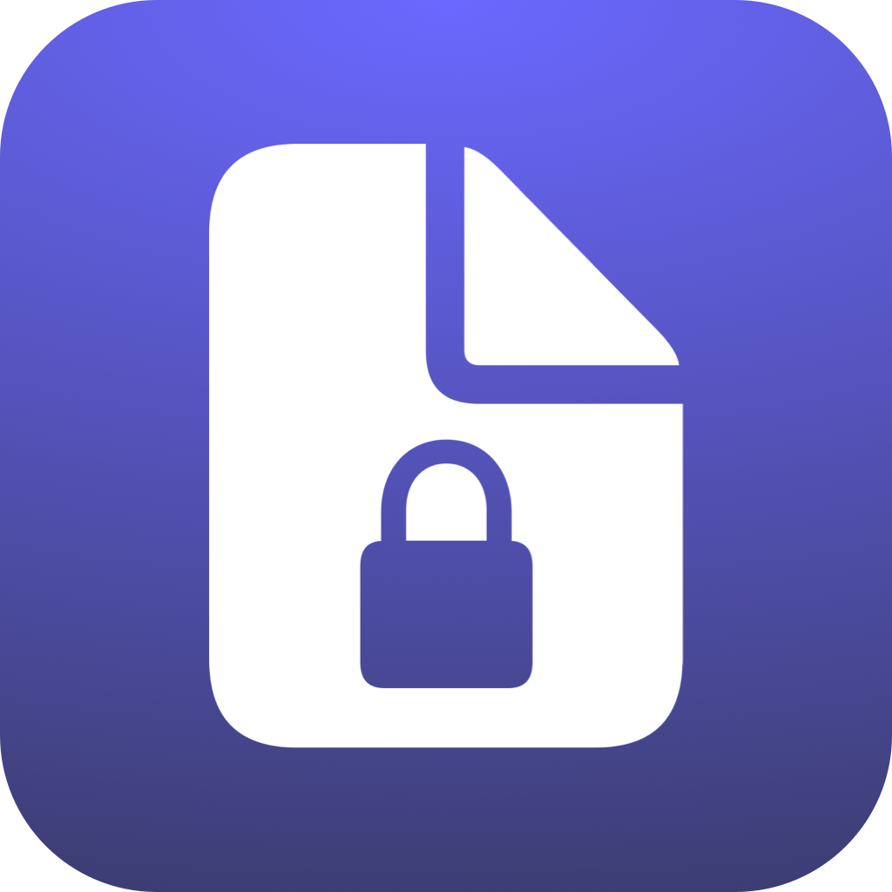

<!-- HEADER -->

<h1> Secure Note </h1>

[][Swift]
[][SwiftUI]
[][iOS]

<!-- BODY -->

## Preview

	

## Description
An Example App to test security features and different settings.

## Feautres

- Saving credentials to Keychain.
- Login screen with remember credentials and face ID login.
- Change app theme color and system appearance settings.
- Ephemeral clipboard that lets the user copy the notes to clipboard for 60 seconds only.
- Auto lock feature that locks the app requireing face ID to unlock.

## Built with:
- Foundation
- SwiftUI
- Combine
- Async/Await
- Keychain

<!-- FOOTER -->
<!-- Permanent links -->
[Swift]: https://www.swift.org
[SwiftUI]: https://developer.apple.com/documentation/swiftui/
[iOS]: https://developer.apple.com/ios/
